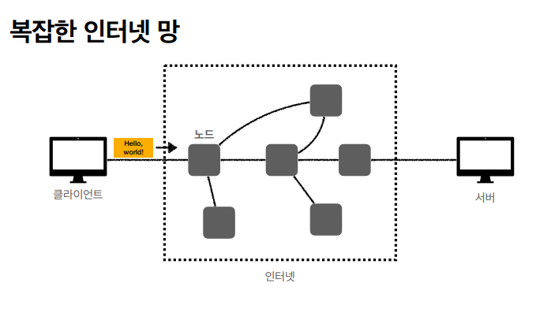
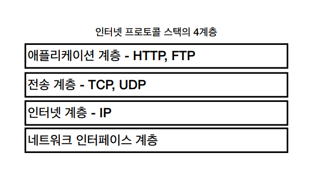
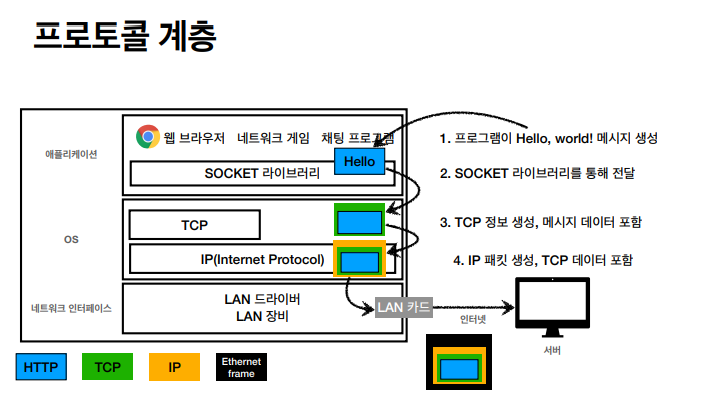
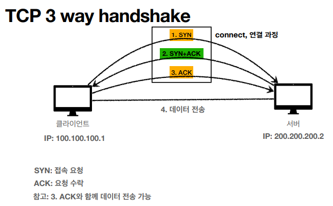
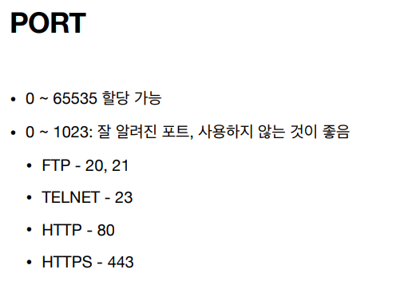

# 인터넷 통신

### 인터넷 통신

> 인터넷 통신은 클라이언트와 서버 를이어주는 단계이다
>
> 클라이언트 - 인터넷(노드) - 서버

### IP(Internet Protocol)

> 지정한 IP 주소(IP Address)에 데이터 전달
>
> 패킷(Packet)이라는 통신 단위로 데이터 전달

### 	IP 프로토콜의 한계

#### 비 연결성

> ​	패킷을 받을 대상이 없거나 서비스 불능 상태여도 패킷 전송

#### 비 신뢰성

​	 패킷 손실: 중간에 패킷이 사라지면?  	

​		인터넷망(노트)를 통해서 데이터를 보내는데 중간의 노드가 	사용 불가한 상태라면 해당 현상 발생

​	패킷 전달 순서 문제 발생 : 패킷이 순서대로 안오면? 

​		패킷의 단위가 클경우 쪼개서 보내는데 이럴경우 해당 문제 		발생	

ex)

1.  클라이언: 1)Hello 2) World! 
2. -> 인터넷 
3. ->  서버: 1)World! 2) Hello 

순서로 도착

#### 프로그램 구분

> 같은 IP를 사용하는 서버에서 통신하는 애플리케이션이 둘 이상이라면? 
>
> ex) 한 컴퓨터에 유튜브와 게임을 동시에 킬경우

이러한 IP 프로토콜의 문제 해결을 위해 나타난 프로토콜 ->TCP

---

### TCP,UDP

#### 인터넷 프로토콜의 4계층

---

애플리케이션에서 hello 메세지가 만들어지면

소캣을 통해 OS로 전달된다 이때 TCP -> IP -> 네트워크 인터페이스(LAN카드) 로 이동하면서 정보가 포장된다.

#### TCP 특징

##### 전송 제어 프로토콜(Transmission Control Protocol)

- 연결지향 -TCP 3 way handshake(가상 연결) 

  

  -> 해당 과정을 통해서 상대방 컴퓨터의 존재 유무 파악

- 데이터 전달 보증

- 순서 보장

- 신뢰할 수 있는 프로토콜
- 현재는 대부분 TCP 사용

---

#### UDP 특징

##### 사용자 데이터그램 프로토콜(User Datagram Protocol)

- 하얀 도화지에 비유(기능이 거의 없음)
- 연결지향 X -TCP3 way handshake X
- 데이터 전달 보증 X
- 순서 보장 X
- 데이터 전달 및 순서가 보장되지 않지만, 단순하고 빠름
- 정리
  - IP와 거의 같다. + PORT(게임인지 유튜브인지) + 체크섬(간단한 검증) 정도만 추가
  - 애플리케이션에서 추가 작업 필요

현재 TCP에서는 최대 속도 더 이상 빠르게 안됨(3 way handshake 사용 )

UDP 에서 해당 문제 해결하려고함.

---

### PORT

한 컴퓨터에서 여러 개(애플리케이션)의 서버와 연결하려면?

포트를 통해서 해당 애플리케이션에 필요한 데이터들을 주고받는다.

기본 적으로 포트정보는 TCP/IP 패킷 정보에 있기 때문에 해당 문제가 해결된다.

참고)

---

### DNS

##### 도메인 네임 시스템(Domain Name System)

- 전화번호부
- 도메인 명을 IP 주소로 변환

IP는 기억하기 어렵다 .ex) ? 200.200.200.2???

IP는 변경될 수 있다.

이러한 문제를 해결해 주는게 **DNS**(Domain Name System)이다.

기존 IP가 바뀔 경우 클라이언트가 IP주소를 직접 알아야하지만,

DNS서버에 등록되어있을 경우 연결된 IP주소만 바꾼다면 기존 도메인 명을 사용하면 된다.