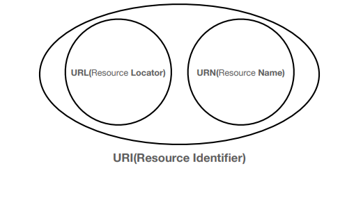
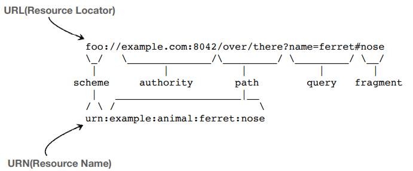
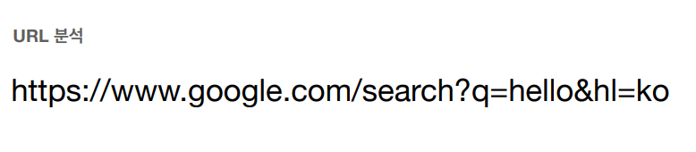
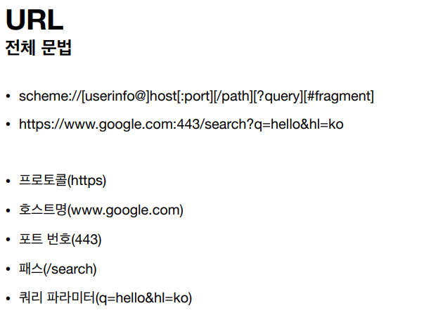
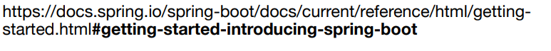

# [URI와 웹 브라우저 요청 흐름]

- URI
- 웹 브라우저 요청 흐름

## URI(Uniform Resource Identifier)

### URI ?URL ?URN ?

> ### "URI는 로케이터( Iocator), 이름(Name)또는 둘 다 추가로 분류 될 수 있다."

### URI

##### 단어 뜻

- Uniform: 리소스 식별하는 통일된 방식
- Resource: 자원, URI로 식별할 수 있는 모든 것(제한 없음)
- Identifier: 다른 항목과 구분하는데 필요한 정보

- URL:Uniform Resource Locator
- URI: Uniform Resource Name

### URL, URN

##### 단어 뜻

- URL - Locator: 리소스가 있는 위치를 지정
- URN - Name : 리소스에 이름을 부여
- 위치는 변할 수 있지만, 이름은 변하지 않는다.
- urn:isbn:8960777331(어떤 책의 isbn URN)
- URN 이름만으로 실제 리소스를 찾을 수 있는 방법이 보편화 되지 않음
- **앞으로 URI를 URL과 같은 의미를 이야기 하겠음**

---

#### userinfo

- URL에 사용자정보를 포함해서 인증
- 거의 사용하지 않음

---

#### host

- 호스트명
- 도메인명 또는 IP 주소를 직접 사용가능

---

#### Port

- 포트(PORT)
- 접속 포트
- 일반적으로 생략, 생략시 http는 80, https는 443

---

#### path

- 리소스 경로(path), 계층적 구조

ex)

- /home/file1.jpg 
  - home에있는 file1.jpg
- /members 
  - members에 대한 정보
- /members/100
  - memebers에 100에 대한 정보
-  /items/iphone12
  - items에 iphone12에 대한 정보

---

#### query

- key = value형태
- ?로 시작, &로 추가 가능 ?keyA=valueA&keyB=valueB
- query parameter, query String 등으로 불림, 웹 서버에 제공하는 파라미터, 문자 형태

---

#### fragment

- html 내부 북마크 등에 사용
- 서버에 전송하는 정보 아님

## 웹 브라우저 요청 흐름

1. 웹 브라우저에서 해당 과정을 통해서 구글 서버에 메세지를 요청하면 해당과정을 통해서 패킷을 만든다.

2. 그러면 구글 서버에서 해당 요청 패킷을 분해하여 HTTP요청 메세지를 통해 결과물을 만듦

   응답 완료 메세지, Content-Type,charset,Content-Length에 대한 정보와

   Content 내용 (<html><body>~~ </body></html>)

   형태로 다시 응답 패킷을 만들어 웹브라우저로 패킷 전송

3. 응답받은 패킷내용을 웹브라우저로 랜더링

해당 과정을 진행한다.

