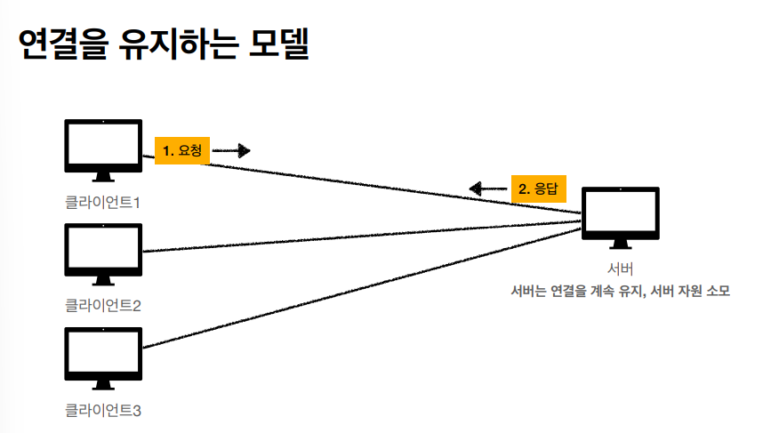

# HTTP기본

## [HTTP]

- **모든 것이 HTTP**
- **클라이언트 서버 구조**
- **Stateful, Stateless**
- **비 연결성(connectionless)**
- **HTTP메시지**

## HTTP(HyperText Transfer Protocol)

**HTTP 메시지에 모든 것을 전송 가능**

- HTML, TEXT
- IMAGE, 음성, 영상, 파일
- JSON, XML( API)
- 거의 모든 형태의 데이터 전송 가능
- 서버간에 데이터를 주고 받을 때도 대부분 HTTP 사용
- **지금은 HTTP 시대!**

## HTTP 역사

- HTTP/0.9 1991년 : GET 메서드만 지원, HTTP 헤더X
- HTTP/1.0 1996년: 메서드, 헤더 추가
- **HTTP/1.1 1997년: 가장 많이 사용, 우리에게 가장 중요한 버전**
  - RFC2068(1997) -> RFC2616(1999) -> RFC7230~7235(2014)
- HTTP/2 2015: 성능 개선
- HTTP/3 진행중: TCP대신에 UDP 사용, 성능개선

참고: HTTP/1.1에 모든 기능이 다 들어있어서 중요

HTTP/2나 HTTP/3은 HTTP/1.1에 대한 성능 개선용

## 기반 프로토콜

- **TCP**: HTTP/1.1, HTTP/2
- **UDP:** HTTP/3
- 현재 HTTP/1.1 주로 사용
  - HTTP/2, HTTP/3 도 점점 증가

참고) 크롬->F12->우클릭 protocol 을 확인하면  h1.1, h2, h3이 있는 것을 볼 수 있는데 HTTP/1.1, 2, 3을 사용하는 것을 알 수 있다.

HTTP/1.1에 스팩만 잘 알면 2와 3은 성능개선이라 어느정도 알 수 있다.

## 클라이언트 서버 구조

- Request Response 구조
- 클라이어느는 서버에 요청을 보내고, 응답을 대기
- 서버가 요청에 대한 결과를 만들어서 응답

참고) 예전에는 클라이언트와 서버가 한가지 개념이였다.(따로 구분 X)

클라이언트와 서버를 나누면 클라이언트는 UI에 대해서만 집중할 수 있고 서버에서는 데이터에 대해서만 고려하면 된다.

따라서 각각 다룰 수 있고 서로 간섭이 없으므로 각자에 대해서만 신경 쓰면 된다.(따로 기능 업데이트 가능) 

## 무상태 프로토콜(Stateless)

- 서버가 클라이언트의 상태를 보존X
- 장점: 서버 확장성 높음(스케일 아웃)
- 단점: 클라이언트가 추가 데이터 전송

## Stateful, Stateless 차이

### **상태유지 - Stateful**

Ex)

- 고객: 이 **노트북** 얼마인가요?
- 점원(A): 100만원 입니다.**(노트북 상태 유지)**

- 고객: **2개** 구매하겠습니다.
- 점원(A): 200만원 입니다. **신용카드, 현금중**에 어떤 걸로 구매 하시겠어요? **(노트북, 2개 상태 유지)**

- 고객: 신용카드로 구매하겠습니다.
- 점원(A): 200만원 결제 완료되었습니다. **(노트북, 2개, 신용카드 상태 유지)**

=> 상태유지는 대화형으로 서로 주고 받는 형태로 결과를 도출해내는 것을 의미한다.

만약 중간에 점원이 (A,B(두번 째),C(세번 째)) 로 나뉜다면

B는 무엇을? 2개 구매하는거지?

C는 ? 무슨 제품을 몇 개 신용카드로 구매하시겠어요? 라는 대답을 할 것이다.

따라서 상태 유지는 중간에 점원이 바뀌면 안된다.

### 무상태 - Stateless, 점원이 중간에 바뀌면?

---

- 고객: 이 **노트북** 얼마인가요?
- 점원A: 100만원 입니다.

- 고객: **노트북 2개** 구매하겠습니다.
- 점원B: 노트북 2개는 200만원 입니다. **신용카드, 현금중**에 어떤 걸로 구매 하시겠어요?

- 고객: **노트북 2개를 신용카드**로 구매하겠습니다.
- 점원C: 200만원 결제 완료되었습니다.

### 정리

---

- **상태 유지:** 중간에 다른 점원이 바뀌면 안된다. (중간에 다른 점원으로 바뀔 때 상태 정보를 다른 점원에게 미리 알려줘야 한다)
- **무상태:** 중간에 다른 점원으로 바뀌어도 된다.
  - 갑자기 고객이 증가해도 점원을 대거 투입할 수 있다.
  - 갑자기 클라이언트 요청이 증가해도 서버를 대거 투입할 수 있다.
- 무상태는 응답 서버를 바꿀 수 있다. -> **무한한 서버 증설 가능**

---

이러한 경우 서버1에만 요청해야하고

서버1이 고장나면 해당 데이터 날라감.

---

무상태 경우 서버1이 고장나도 서버2로 바꿔서 요청하면 됨.

또한 특정 이벤트 같이 트레픽이 급격히 증가하는 경우가 생기면 서버를 확장시키면 됨.

### Stateless 실무 한계

---

- 모든 것을 무상태로 설계 할 수 있는 경우도 있고 없는 경우도 있다.
- 무상태 
  - Ex) 로그인이 필요 없는 단순한 서비스 소개 화면
- 상태 유지
  - Ex) 로그인
- 로그인한 사용자의 경우 로그인 했다는 상태를 서버에 유지
- 일반적으로 브러우저 쿠키와 서버 세션등을 사용해서 상태 유지
- 상태 유지는 최소한만 사용

## 비 연결성(connectionless)

연결을 유지하는 모델은 TCP/IP를 통해서 클라이언트마다 서버로 유지한다. 이러한 경우 서버에서는 연결을 계속 유지하느라 서버 자원을 계속해서 소비한다.

연결을 유지하지 않는 모델에서는 클라이언트에서는 기본적으로 요청을하면 서버에서는 응답을하고 TCP/IP 연결을 종료한다.

이러한 방법을 통해서 서버에서는 연결을 유지 안함으로 인해서 자원을 최대한 활용할 수 있다.

### 비 연결성

- HTTP는 기본이 연결을 유지하지 않는 모델
- 일반적으로 초 단위의 이하의 빠른 속도로 응답
- 1시간 동안 수천명이 서비스를 사용해도 실제 서버에서 동시에 처리하는 요청은 수십개 이하로 매우 작음
  - Ex) 웹 브라우저에서 계속 연속해서 검색 버튼을 누르지 않는다. ->검색 버튼을 누를 경우에만 연결해서 응답해주고 연결 끊기 가능
- 서버 자원을 매우 효율적으로 사용할 수 있음

---

#### 한계와 극복

- TCP/IP 연결을 새로 맺어야 함 - 3 way handshake 시간 추가
- 웹 브라우저로 사이트를 요청하면 HTML뿐만 아니라 자바스크립트, css, 추가 이미지 등 수 많은 자원이 함께 다운로드
- 지금은 HTTP 지속 연결(Persistent Connections)로 문제 해결
- HTTP/2, HTTP/3에서 더 많은 최적화

### 스테이스리스를 기억하자

#### 서버 개발자들이 어려워하는 업무

- 정말 같은 시간에 딱 맞추어 발생하는 대용량 트래픽
- Ex)선착순 이벤트, 명절 KTX 예약, 학과 수업 등록
- Ex) 저녁 6:00 선착순 1000명 치킨 할인 이벤트 ->수만명 동시 요청

## HTTP 메세지

HTTP-message는 해당 구조로 이루어져 있다.

HTTP 요청 메시지에도 message body가 포함 될 수도 있다.

### HTTP메서드

- 종류: GET,POST, PUT, DELETE...
- 서버가 수행해야 할 동작 지정
  - GET:리스트 조회(전달하고 싶은 데이터 **쿼리스트링**을 통해서 전달 Ex)../?username=abc&height=200 (Read)
  - POST: 요청(데이터) 내역 처리(Create)
  - PUT:리소스를 대체(수정)하는 메서드(Update)
  - DELETE: 리소스 제거하는 메서드(Delete)
  - ......

---

#### HTTP 헤더

- header-field = field-name ":" OWS field-value OWS (OWS:띄어쓰기 허용)
- field-name은 대소문자 구문 없음
- HTTP 전송에 필요한 모든 부가 정보
- ex) 메시지 바디의 내용, 메시지 바디의 크기, 압축, 인증, 요청 클라이언트(브라우저) 정보,
- 표준 헤더가 너무 많음
- 필요시 임의의 헤더 추가 가능

---

#### 메시지 바디

- 실제 전송할 데이터
- HTML문서, 이미지, 영상, JSON 등등 byte로 표한할 수 있는 모든 데이터 전송 가능

### 단순함 확장 가능

- HTTP는 단순하다. 스펙도 읽어볼만..
- HTTP메시지도 매우 단순
- 크게 성공하는 표준 기술은 단순하지만 확장 가능한 기술

---

### HTTP 정리

- HTTP 메시지에 모든 것을 전송
- HTTP 역사 HTTP/1.1을 기준으로 학습
- 클라이언트 서버 구조
- 무상태 프로토콜(stateless)
- HTTP 메시지
- 단순함, 확장 가능
- **지금은 HTTP 시대**

---

### HTTP 메서드

- HTTP API를 만들어보자
- HTTP 메서드 - GET, POST
- HTTP 메서드 -PUT,PATCH, DELETE
- HTTP 메서드의 속성

