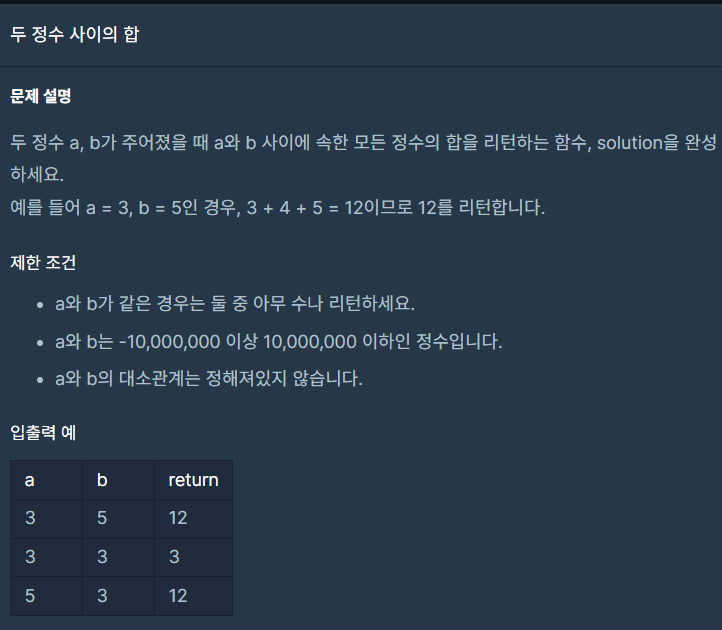

## 문제



## 풀이

```python
def solution(a, b):
    answer = 0
    if a>b:
        a,b=b,a
    for i in range(a,b+1):
        answer+=i
    print(answer)
    
    return answer
```


## 다른사람 풀이

```python
def adder(a, b):
    # 함수를 완성하세요
    if a > b: a, b = b, a

    return sum(range(a,b+1))

# 아래는 테스트로 출력해 보기 위한 코드입니다.
print( adder(3, 5))
```

sum(range())를 통하여 범위의 합을 간단히 표현가능하다.
