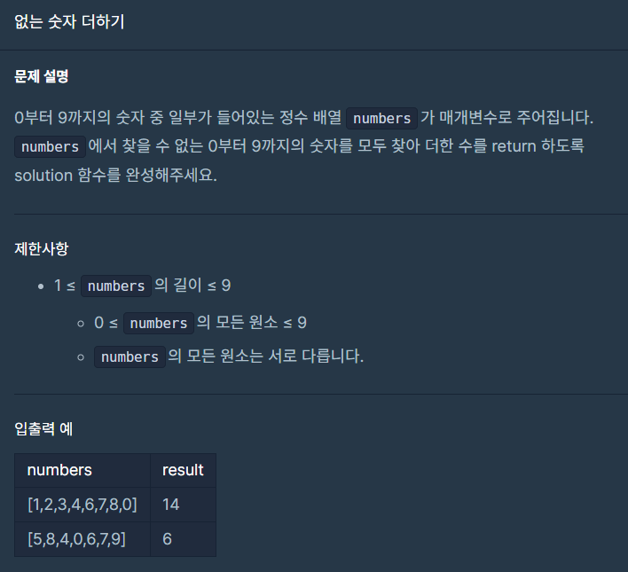
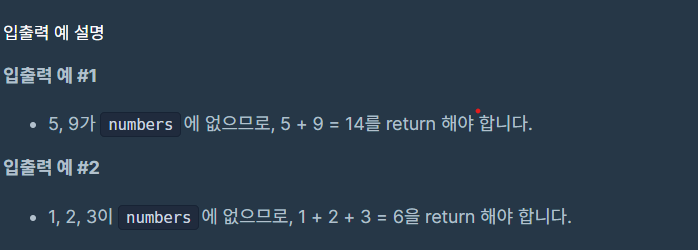

## 문제





## 내 풀이

```python
def solution(numbers):
    answer = 0
    for i in range(10):
        if i not in numbers:
            answer+=i
    return answer
```


## 다른사람 풀이

```python
def solution(numbers):
    return 45 - sum(numbers)
```

총합을 기준으로 numbers배열에 있는 숫자를 더한값을 뺌

생각보다 간단하게 풀 수 있었네요.. 


현재 LV.1 문제 1페이지를 드디어 다 풀었네요 정답률 높은 순으로 풀으니 초반에는

아직 막히는거 없이 풀리긴 하네요 ㅎㅎ 내일부터 2페이지 풀어야지~
