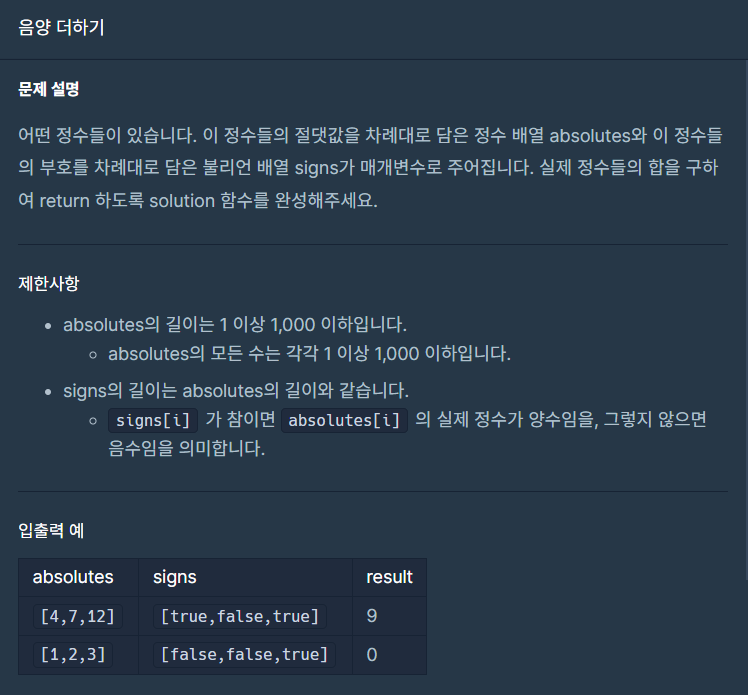
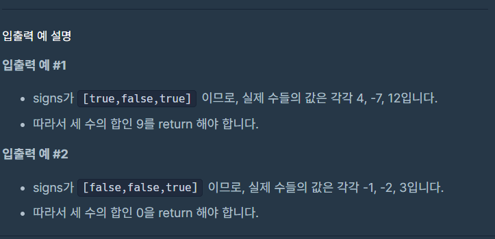

## 문제





## 내 풀이

```python
def solution(absolutes, signs):
    for x in range(len(signs)):
        if signs[x] == False:
            absolutes[x]=-absolutes[x]
    answer = sum(absolutes)
    return answer
```


## 다른사람 풀이

```python

def solution(absolutes, signs):
    return sum(absolutes if sign else -absolutes for absolutes, sign in zip(absolutes, signs))
```

