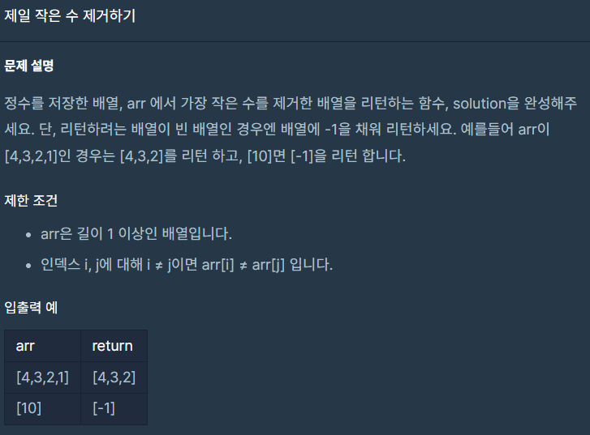

## 문제



## 풀이

```python
def solution(arr):   
    if len(arr)==1:
        answer=[-1]
    else:
        arr.remove(min(arr))
        answer=arr    
    return answer
```


## 다른사람 풀이

```python
def rm_small(mylist):
    return [i for i in mylist if i > min(mylist)]

```

