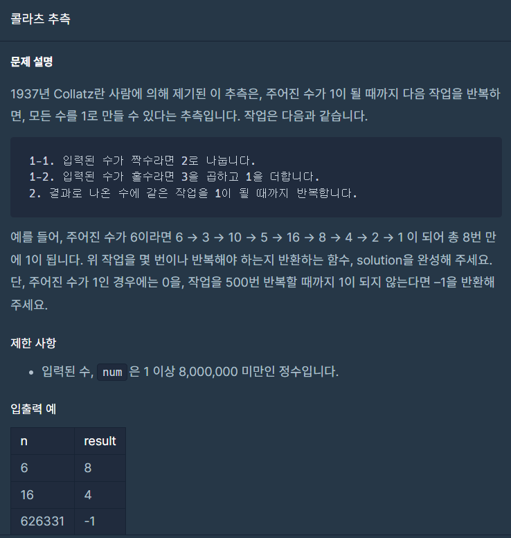
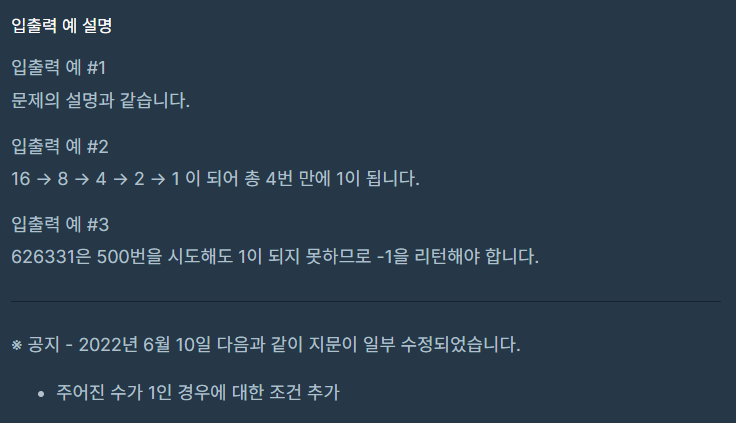

## 문제






## 풀이

```python
def solution(num):
    answer = 0
    while(num!=1):
        if answer>500:
            return -1
        if num%2!=1:
            num=num/2
            answer+=1
        else:
            num=(num*3)+1
            answer+=1
    return answer
```


## 다른사람 풀이

```python
def collatz(num):
    for i in range(500):
        num = num / 2 if num % 2 == 0 else num*3 + 1
        if num == 1:
            return i + 1
    return -1
```

