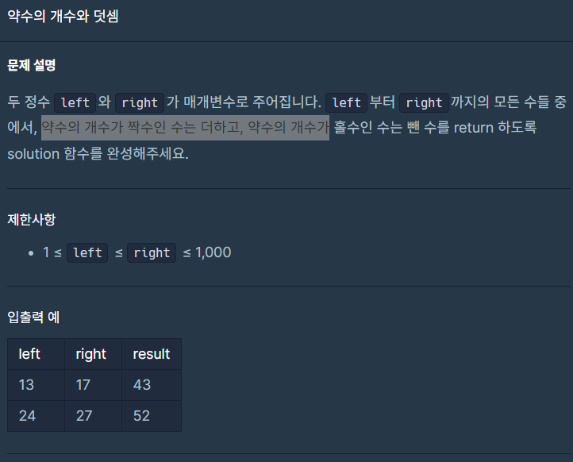

## 문제



## 풀이

```python
def solution(left, right):
    answer = 0
    for i in range(left, right+1): 
        cnt=0 
        for j in range(1,i+1):    
            if i%j==0 : 
                cnt+=1 
        if cnt%2==0:
            answer+=i
        else:
            answer-=i
    return answer
```


## 다른사람 풀이

```python
def solution(left, right):
    answer = 0
    for i in range(left,right+1):
        if int(i**0.5)==i**0.5:
            answer -= i
        else:
            answer += i
    return answer
```

<a href="https://school.programmers.co.kr/learn/courses/30/lessons/77884/solution_groups?language=python3">프로그래머스</a>

왜 이렇게 푸는데 정답이 나오지 하고 찾아봤는데 제곱수를 제외한 모든 정수들의 약수의 개수는 무조건 짝수 개수이며 제곱수만 홀수 개수라고 하네요 ㅎㄷㄷ..

어떻게 이런 생각을 하는건지... 정말 대단하네요..
