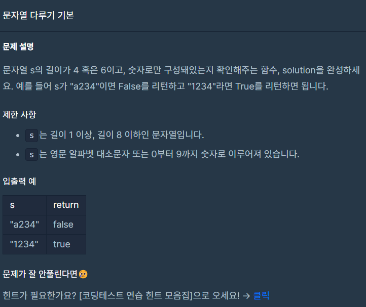

## 문제



## 풀이

```python
def solution(s):
    answer = True
    if len(s) == 4 or len(s)==6:
        try:
            int(s)
        except:
            answer= False
    else:
        answer=False
    return answer
```


## 다른사람 풀이

```python
def alpha_string46(s):
    return s.isdigit() and len(s) in (4, 6)
```

여기는 isdigit()로 풀었네요 len 길이는 in 으로 풀었구요
