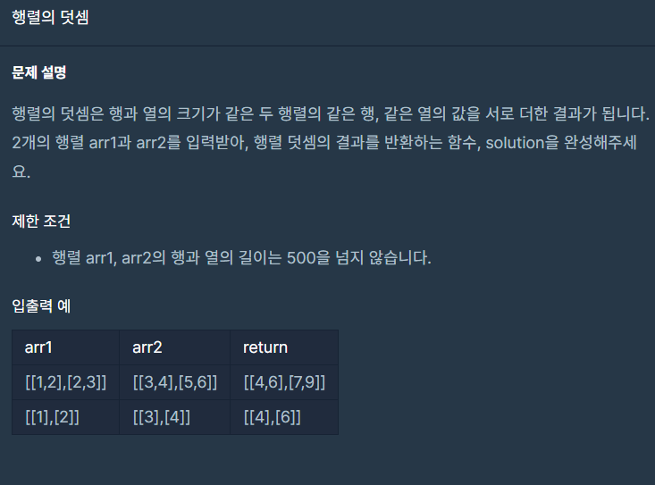

## 문제



## 풀이

```python
def solution(arr1, arr2):
    answer=[]
    aLen=len(arr1)
    for i in range(aLen):
        answer.append([])
        for a,b in zip(arr1[i],arr2[i]):
            answer[i].append(a+b)
    return answer
```


## 다른사람 풀이

<a href="https://school.programmers.co.kr/learn/courses/30/lessons/12950/solution_groups?language=python3">프로그래머스</a>

```python
def sumMatrix(A,B):
    return [list(map(sum, zip(*x))) for x in zip(A, B)]
```

댓글을 보니 *x는 unpacking이라고 하네요.

이런게 있다니 ㅠ 하나 알아갑니다!
