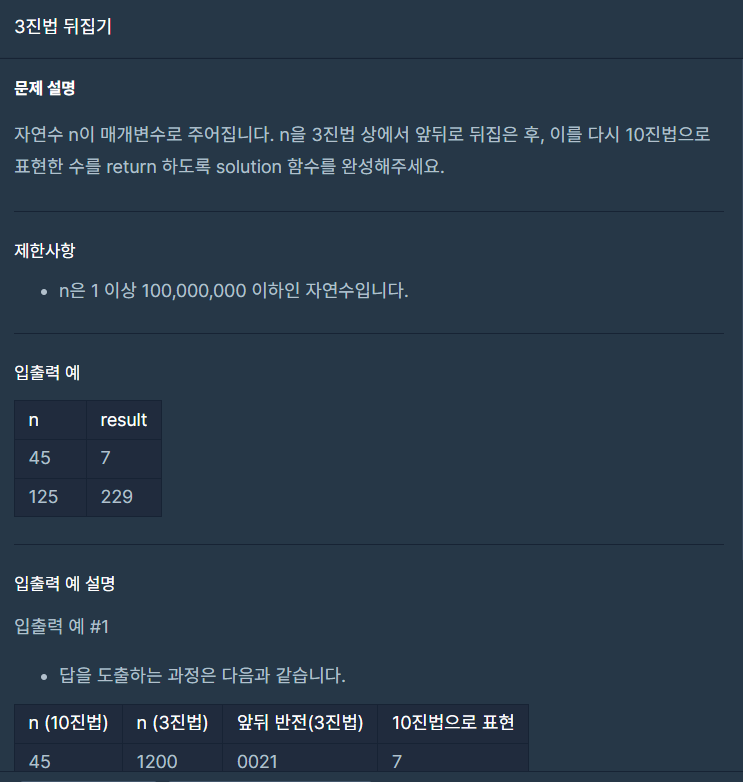

## 문제



## 풀이

```python
def solution(n):
    answer = ''
    while(n!=0):
        answer+=str(n%3)
        n=n//3
    
    return int(answer,3)
```

while문을 통하여 풀면 나오는 answer은 뒤집어서 나온다.

따라서 reverse를 따로 쓸 필요가 없으며

int(string, 진법)을 통해 10 진수로 바꿔서 return 해주면 정답이 나온다.


## 다른사람 풀이

<a href="https://school.programmers.co.kr/learn/courses/30/lessons/68935/solution_groups?language=python3">프로그래머스</a>

```python

def solution(n):
    tmp = ''
    while n:
        tmp += str(n % 3)
        n = n // 3

    answer = int(tmp, 3)
    return answer
```

매개변수만 다를 뿐 같은 식이다.
