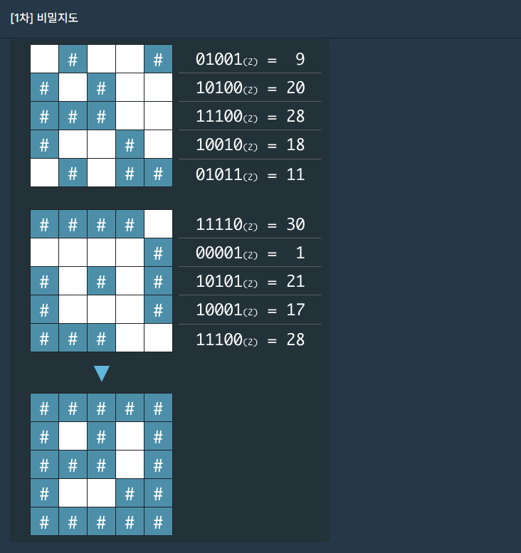
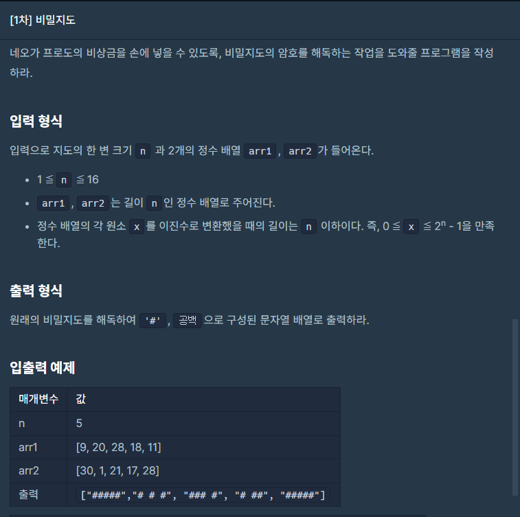

## 문제







## 풀이

```python
def binory(i,n):
    arr=list(format(i, 'b'))
    while(len(arr)!=n):
        arr.insert(0,'0')
    return arr
    

def solution(n, arr1, arr2):
    answer = [[0]*n for _ in range(n)]
    a=[]
    b=[]
    board=[]
    for i in arr1:
        a.append(binory(i,n))
    for i in arr2:
        b.append(binory(i,n))
    for i in range(n):
        for j in range(n):
            if a[i][j]=='1' or b[i][j]=='1':
                answer[i][j]='#'
            else:
                answer[i][j]=' '
    for i in answer:
        board.append("".join(i))
    return board
```


푸는 시간이 다른 문제들에 비해 오래 걸렸네요 ㅠ

뭔가 복잡하게 풀었을거같은 느낌...


## 다른사람 풀이

<a  href="https://school.programmers.co.kr/learn/courses/30/lessons/17681/solution_groups?language=python3">프로그래머스</a>

```python
def solution(n, arr1, arr2):
    answer = []
    for i,j in zip(arr1,arr2):
        a12 = str(bin(i|j)[2:])
        a12=a12.rjust(n,'0')
        a12=a12.replace('1','#')
        a12=a12.replace('0',' ')
        answer.append(a12)
    return answer
```

ㅋㅋㅋ 다른사람 풀이 보니까 왠지 제가 한심하게 느껴지는... ㅠ

bin()이 제가쓴 binory함수처럼 2진수 돌려준다고 하네요.

[2:]는 bin()함수를 사용하면 앞에 Ob붙어서 그거 없애서 출력하려고 한거 같네요.

**rjust 함수는** 문자열을 **오른쪽 정렬**해서 보기좋게 출력할 때 쓴다고 하네요.

형태는 **문자열.rjust(전체 자리 숫자, 공백이 있을 경우 공백을 채울 텍스트)** 

공백을 공백 그대로 두려면 아무것도 입력하지 않으면 된다고 하네요 괞히 while문 돌린듯한 기분..ㅠ.

다음에는 함수들을 더 활용해서 짧게 만들어야지 ㅎㅎ

