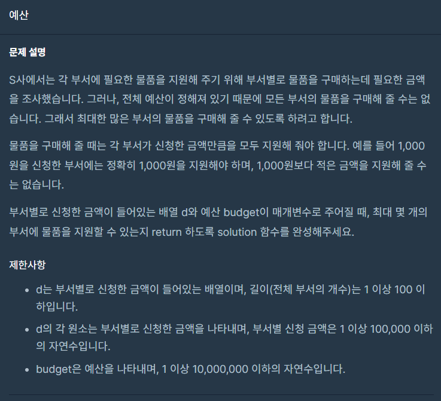

## 문제



## 풀이

```python
def solution(d, budget):
    answer = 0
    d.sort()
    for i in range(len(d)):
        if budget>=d[i]:
            answer+=1
            budget-=d[i]
        else:
            break
    return answer
```


## 다른사람 풀이

<a href="https://school.programmers.co.kr/learn/courses/30/lessons/12982/solution_groups?language=python3">프로그래머스</a>

```python
def solution(d, budget):
    d.sort()
    while budget < sum(d):
        d.pop()
    return len(d)
```

코드는 훨씬 짧아졌지만 댓글에서 sum()을 반복하니 시간복잡도는 증가되었다고

합니다.  하나씩 빼는 편이 더 빠르다고 합니다.
