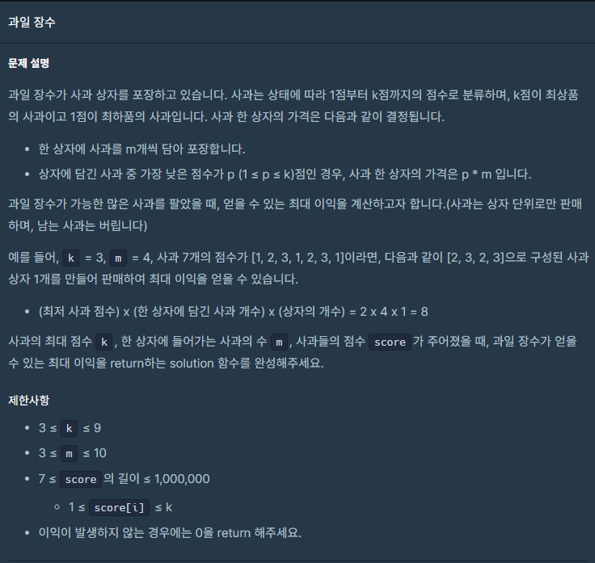

## 문제



## 풀이

```python
def solution(k, m, score):
    answer = 0
    score.sort(reverse=True)
    for i in range(0,m*(len(score)//m),m):
        answer+=min(score[i:m+i])*m
    return answer
```

흠...매개변수k의 존재 의미를 모르겠다.. 없어도 잘 풀리는데.. 


## 다른 사람 풀이

<a  href="https://school.programmers.co.kr/learn/courses/30/lessons/135808/solution_groups?language=python3">프로그래머스</a>

```python
def solution(k, m, score):
    return sum(sorted(score)[len(score)%m::m])*m
```

다른 사람들도 매개변수 k 는 사용하지 않았다.. 나만 그런게 아니였구낭 ㅎㅎ
