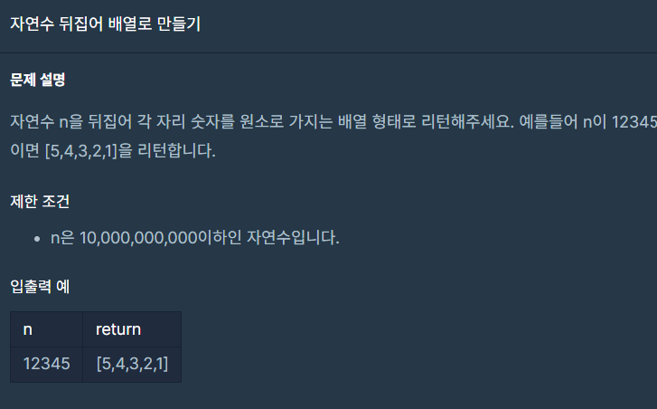

## 문제



## 풀이

처음 풀었던 식

```python
def solution(n):
    n=list(map(int,str(n)))
    answer=sorted(n,reverse=True)
    return answer
```

전체 케이스중 몇개만 통과한다.

이유: sorted()하는것은 정렬하는건데 정렬을하고 reverse를 한다면 13245가 54321 로 바뀌기때문에

원하는 답과는 다른 결과가 나온다 따라서 sorted가 아닌 revesered를 사용해야 원하는 답이 나온다.


```python
def solution(n):
    return list(map(int,reversed(str(n))))
```


## 주의할 점

sort()는 정렬을 해주는 함수이다.

