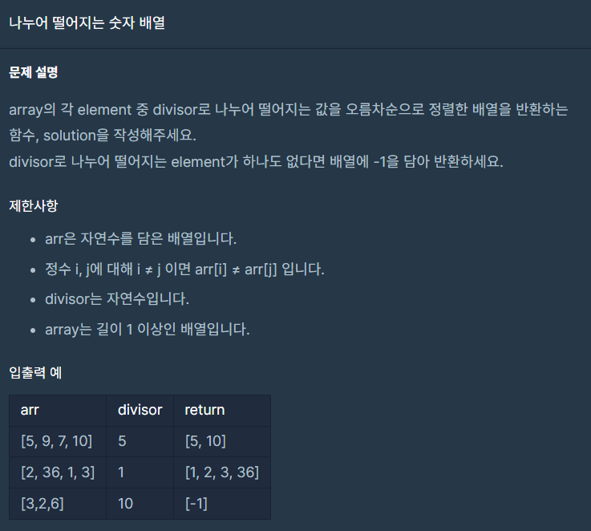
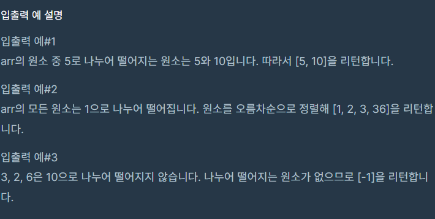

## 문제





## 풀이

```python
def solution(arr, divisor):
    answer = []
    for i in arr:
        if i%divisor==0:
            answer.append(i)
    answer=sorted(answer)
    if len(answer)==0:
        answer.append(-1)
    return answer
```


## 다른사람 풀이

```python
def solution(arr, divisor): return sorted([n for n in arr if n%divisor == 0]) or [-1]
```

