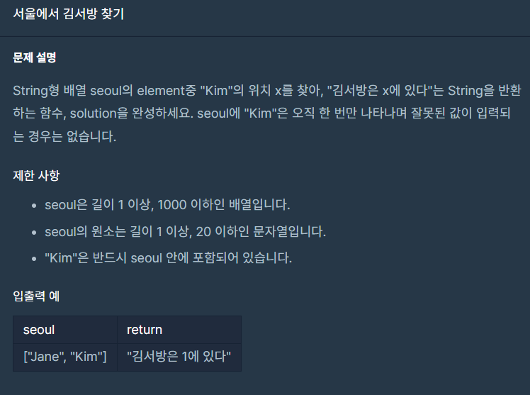

## 문제




## 풀이

```python
def solution(seoul):
    cnt=0
    for i in seoul:
        if i=="Kim":
            break 
        cnt+=1
    answer="김서방은 {}에 있다".format(str(cnt))
    return answer
```


## 다른사람 풀이

```python
def findKim(seoul):
    return "김서방은 {}에 있다".format(seoul.index('Kim'))
```

index함수를 통해 리스트의 위치 인덱스를 구함
