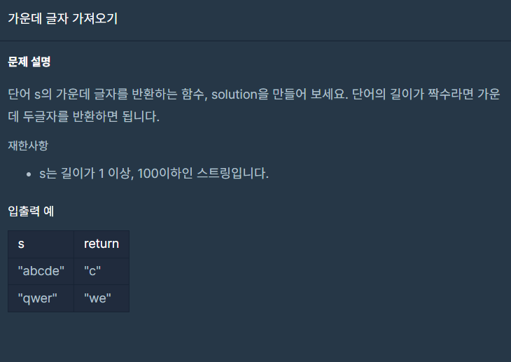

## 문제



## 풀이

```python
def solution(s):
    sLen=len(s)
    answer = ''
    if sLen % 2==1:
        answer=s[sLen//2]
    else:
        answer=s[sLen//2-1:sLen//2+1]
    return answer
```


## 다른사람 풀이

```python
def string_middle(str):
    return str[(len(str)-1)//2:len(str)//2+1]
```

if문없이 생각보다 코드가 짧아져서 놀랐다...
