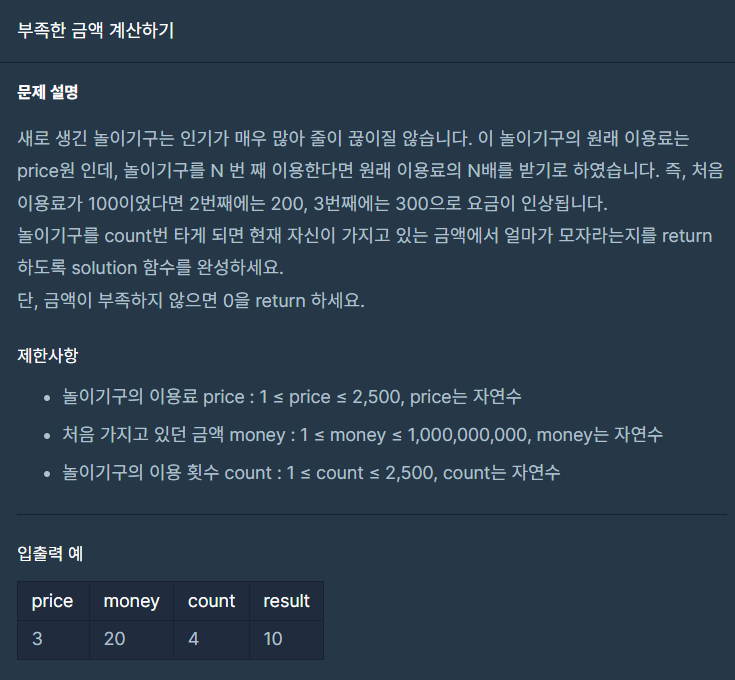

## 문제



## 풀이

```python
def solution(price, money, count):
    for i in range(1,count+1):
        money=money-price*i     
    if money>0:
        return 0
    else:
        answer = -money  
    return answer
```


## 다른사람 풀이

```python
def solution(price, money, count):
    return max(0,price*(count+1)*count//2-money)
```

<a href="https://school.programmers.co.kr/learn/courses/30/lessons/82612/solution_groups?language=python3">프로그래머스</a>

등차수열의 합 공식을 구해주면 price*(count**2)+count//2 - money라고하네요
