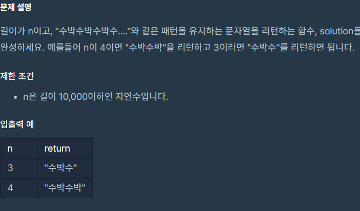

## 문제



## 풀이

```python
def solution(n):
    a="수박"
    b="수"
    if n%2==1:
        answer=a*(n//2)+b
    else:
        answer=a*(n//2)
    return answer
```


## 다른사람 풀이

```python
def water_melon(n):
    s = "수박" * n
    return s[:n]
```

if문을 안쓰고 수박이라는 str을 만든후 그냥 길이를 출력할줄은...
