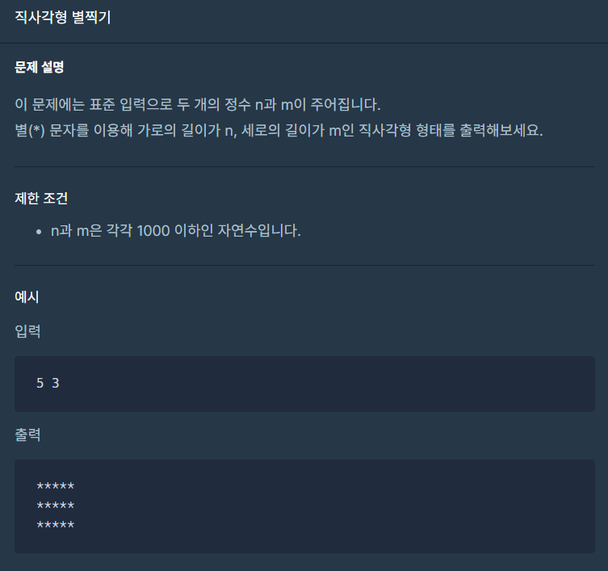

## 문제



## 풀이

```python
a, b = map(int, input().strip().split(' '))
for _ in range(b):
    print('*'*a)
```


## 다른사람 풀이

```python
a, b = map(int, input().strip().split(' '))
answer = ('*'*a +'\n')*b
print(answer)
```


<a href="https://school.programmers.co.kr/learn/courses/30/lessons/12969/solution_groups?language=python3">프로그래머스</a>

굳이 for문을 돌릴 필요는 없었네요 ㅎㅎ
