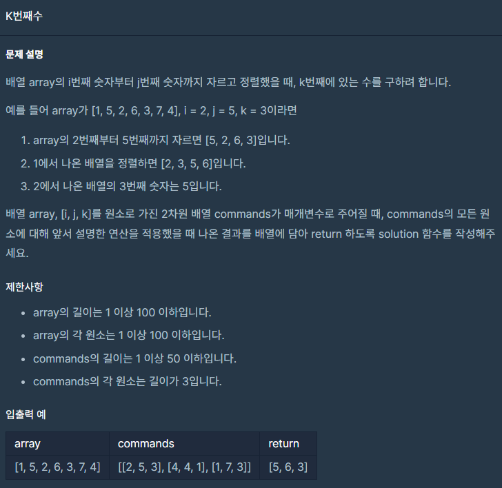

## 문제



## 풀이

```python
def k(array,i,j,k):
    array=array[i-1:j]
    array.sort()
    return array[k-1]


def solution(array, commands):
    answer = []
    for i in commands:
        answer.append(k(array,i[0],i[1],i[2]))
    return answer
```


## 다른사람 풀이

<a  href="https://school.programmers.co.kr/learn/courses/30/lessons/42748/solution_groups?language=python3">프로그래머스</a>

```python
def solution(array, commands):
    return list(map(lambda x:sorted(array[x[0]-1:x[1]])[x[2]-1], commands))
```

이게 한 줄에 되다니.... 다들 왜 이리 잘 난 건지 ㅋㅋ 부럽네요 ㅠ

그래도 벌써 lv1에 2페이지까지 풀었네요 ㅎㅎ 이제 2페이지만 더 풀면

lv2로 넘어갈 수 있겠네요. (그만큼 더 어려워지겠지?... 지금도 어려운데 ㅠ)
