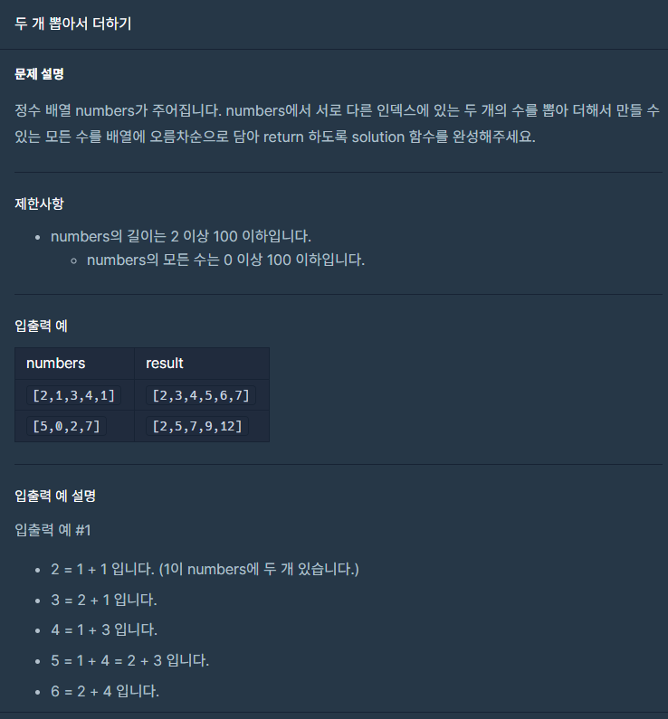

## 문제



## 풀이

```python
def solution(numbers):
    answer = []
    a=set()
    aLen=len(numbers)
    for i in range(aLen):
        for j in range(i+1,aLen):
            a.add(numbers[i]+numbers[j])
    answer=list(a)
    return sorted(answer)
```


## 다른사람 풀이

<a  href="https://school.programmers.co.kr/learn/courses/30/lessons/68644/solution_groups?language=python3">프로그래머스</a>

```python
def solution(numbers):
    answer = []
    for i in range(len(numbers)):
        for j in range(i+1, len(numbers)):
            answer.append(numbers[i] + numbers[j])
    return sorted(list(set(answer)))
```

풀이는 같지만 저보다 코드 수가 더 적네요 ㅎㅎ
