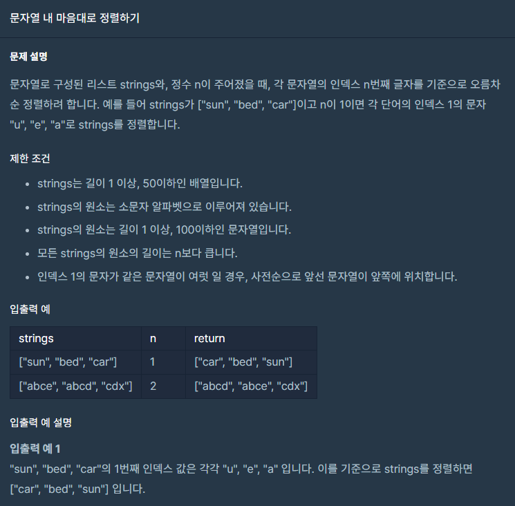

## 문제



## 풀이

```python
def solution(strings, n):
    answer = [] 
    strings.sort()
    answer=sorted(strings,key=lambda string:(string[n]))
    return answer
```


### 주의

처음에는 아래 있는 다른사람 풀이처럼 sort()를적용안하고 

key=lambda string:(string[n])으로 했다가 문제를 틀렸다 ㅠ..


## 다른사람 풀이

<a  href="https://school.programmers.co.kr/learn/courses/30/lessons/12915">프로그래머스</a>

```python
def strange_sort(strings, n):
    '''strings의 문자열들을 n번째 글자를 기준으로 정렬해서 return하세요'''
    return sorted(strings, key=lambda x: x[n])
```

나는 왜 이 식으로 적용했는데 안되었지...? 라는 궁금증이 생긴다...

댓글보면 안되는 사람도 몇명 있던데.. 왜 이게 된거지??... 모르겠다..

return sorted(strings, key=lambda str: (str[n], str)) 이렇게 하면 한줄로 가능합니다.

라는 댓글이 있는데 굳이 처음에 sort()를 하지 않더라도 (조건1, 조건2)를 통해

다중조건이 가능하다는 점을 알았다.!
