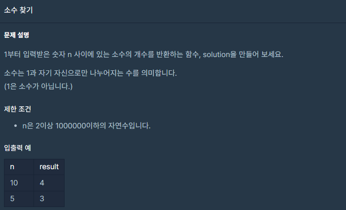

## 문제



## 풀이

```python
def numberOfPrime(n):
    # 1부터 n사이의 소수는 몇 개인가요?
    count=0
    for n in range(2,n+1):
        for i in range(2,n):
            if n%i==0:
                break
        else:
            count+=1
    return count
```

처음에 이렇게 풀었는데 효율성 문제에서 탈락 ㅠㅠ

테스트 케이스는 통과했는데...

### 두번째 풀이

```python
def solution(n):
    ch=[0]*(n+1)
    cnt=0

    for i in range(2, n+1):
        if ch[i]==0:
            cnt+=1
            for j in range(i,n+1,i):
                ch[j]=1
    return cnt
```

일단 n만큼의 배열을 만든 후

1을 제외하고 2부터 배열안에 배수가 있으면 배열의 값을 1로 만들어준다.

그러면 2일때(2,4,6,8~ 2의배수 가 1로 바뀌고) 3일때도 똑같이 1로바뀐다. 물론 해당 수의 배수를 1로  바꾸기전에 cnt+=1 해줘야 한다.  그렇게 하면 소수의 개수를 얻을 수 있다.

## 다른사람 풀이

<a  href="https://school.programmers.co.kr/learn/courses/30/lessons/12921/solution_groups?language=python3">프로그래머스</a>

```python
def solution(n):
    num=set(range(2,n+1))

    for i in range(2,n+1):
        if i in num:
            num-=set(range(2*i,n+1,i))
    return len(num)
```

