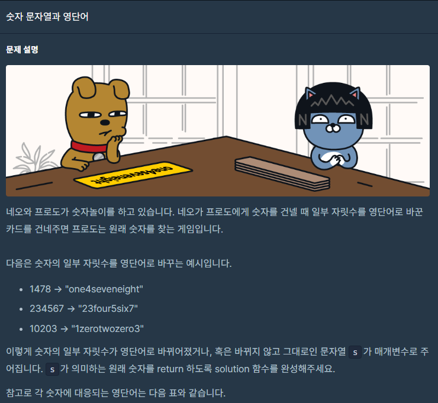
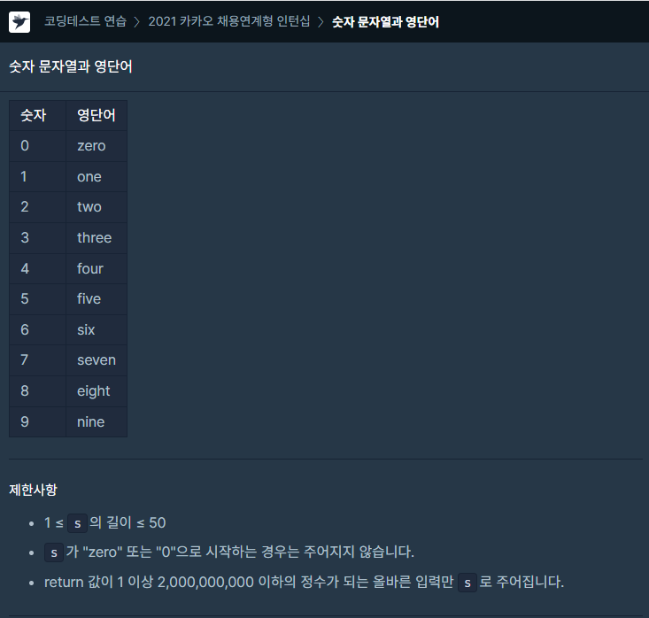

## 문제



## 

## 풀이

```python
def solution(s):
    string=["zero","one","two","three","four","five","six","seven","eight"
            ,"nine"]
    num=['0','1','2','3','4','5','6','7','8','9']
    for i in range(10):
        s=s.replace(string[i],num[i])
    answer = int(s)
    return answer
```


replace()함수를 사용하여 해당 문자열을 바꿔주었습니다!

처음에는 s.replace(string[i],num[i])을 사용해서 틀렸는데

변수에 대입해야 하더라구요ㅠ 왜? 안바뀌지 하고 있었는데 ㅎㅎ

그래도 풀었으니 ㅎㅎ..

## 다른사람 풀이

<a  href="https://school.programmers.co.kr/learn/courses/30/lessons/81301/solution_groups?language=python3">프로그래머스</a>

```python

num_dic = {"zero":"0", "one":"1", "two":"2", "three":"3", "four":"4", "five":"5", "six":"6", "seven":"7", "eight":"8", "nine":"9"}

def solution(s):
    answer = s
    for key, value in num_dic.items():
        answer = answer.replace(key, value)
    return int(answer)
```

이분은 dictionary 를 통해 key와 value로 풀으셨더라구요.
