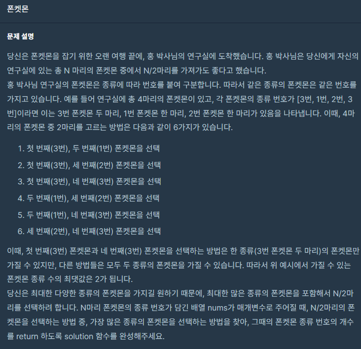
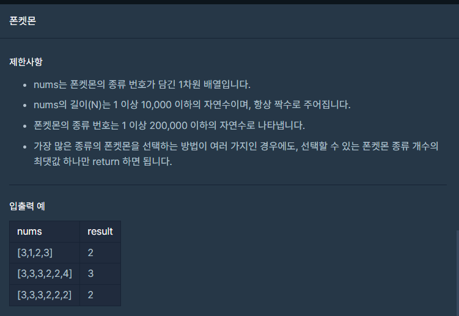

## 문제



## 

## 풀이

```python
def solution(nums):
    answer=0
    numset= len(set(nums))
    if (len(nums)//2)<numset:
        return len(nums)//2
    else:
        return numset
```


## 다른사람 풀이

<a  href="https://school.programmers.co.kr/learn/courses/30/lessons/1845/solution_groups?language=python3">프로그래머스</a>

```python
def solution(ls):
    return min(len(ls)/2, len(set(ls)))
```

이게 뭐야.. ㅎㄷㄷ 한줄이네요 ㅠ
