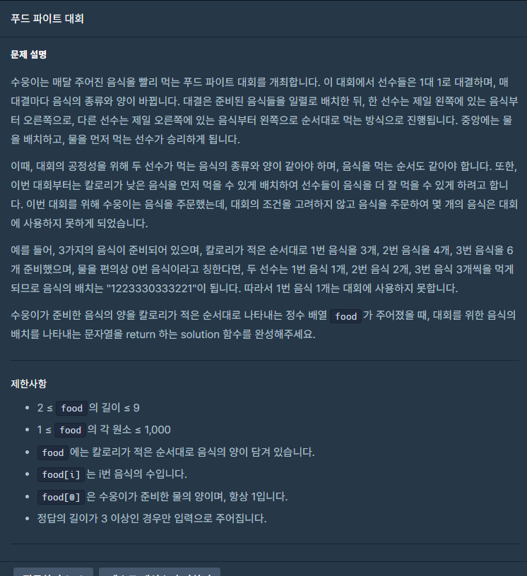

## 문제



## 풀이

```python
def solution(food):
    answer = ''
    for i in range(1,len(food)):
        answer=str(i)*(food[i]//2)+answer
    return answer[::-1]+str(0)+answer
```


## 다른사람 풀이

<a  href="https://school.programmers.co.kr/learn/courses/30/lessons/134240/solution_groups?language=python3">프로그래머스</a>

```python
def solution(food):
    answer = ''
    rev=''
    for i in range(1,len(food)):
        answer+=str(i)*(food[i]//2)
    rev=answer[::-1]
    answer+='0'

    return answer+rev
```

비슷한 풀이네용 
