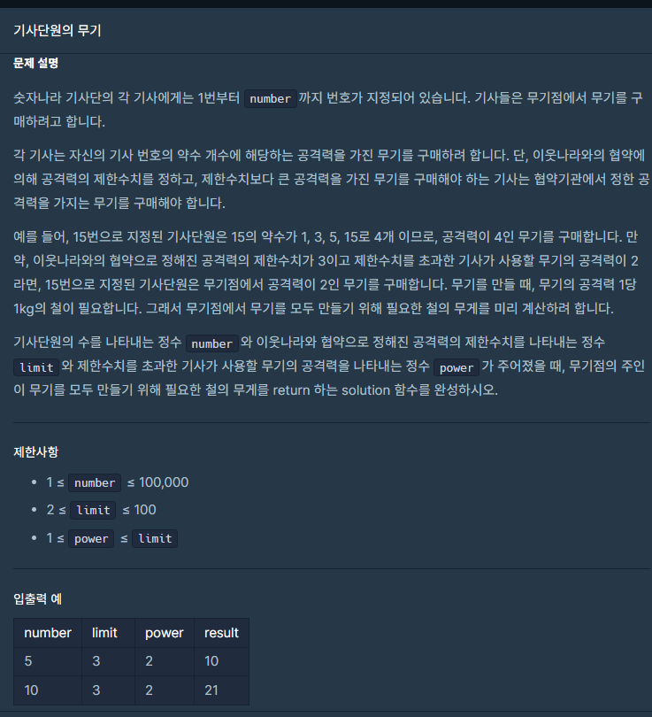

## 문제




### 처음 풀이

```python
def solution(number, limit, power):
    answer = 0
    for i in range(1,(number+1)):
        cnt=0
        for j in range(1, i+1):
            if i%j == 0:
                cnt += 1
        if cnt>limit:
            answer+=power
        else:
            answer+=cnt
    return answer
```

처음 풀었던 식은 테스트 케이스 통과, 몇몇 케이스들은 통과하지만

런타임 오류로 불통과된다.

효율을 높인 두번째 풀이식으로 하면 잘 통과된다.


## 두 번째 풀이

```python
def solution(number, limit, power):
    answer = 0
    for i in range(1,(number+1)):
        cnt=0
        for j in range(1, int(i**(0.5))+1):
            if i%j == 0:
                cnt += 1
                if j**2 != i: 
                    cnt+=1
        if cnt>limit:
            answer+=power
        else:
            answer+=cnt
    return answer
```

범위를 제곱으로 하여 시간을 줄임

## 다른사람 풀이

<a  href="https://school.programmers.co.kr/learn/courses/30/lessons/136798/solution_groups?language=python3">프로그래머스</a>

```python

def cf(n): # 공약수 출력
    a = []
    for i in range(1,int(n**0.5)+1):
        if n%i == 0:
            a.append(n//i)
            a.append(i)
    return len(set(a))
def solution(number, limit, power):
    return sum([cf(i) if cf(i)<=limit else power for i in range(1,number+1)])
```

