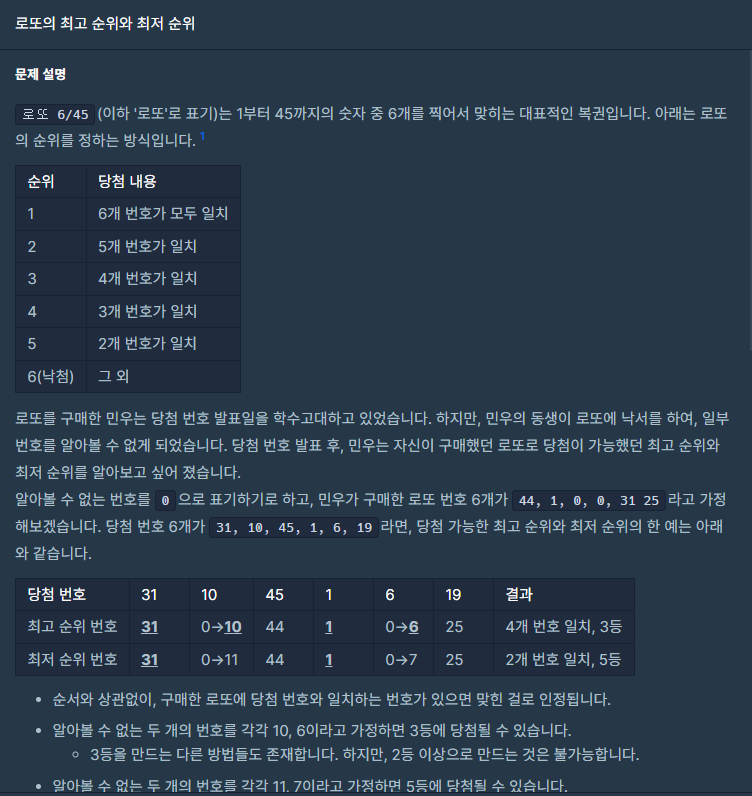
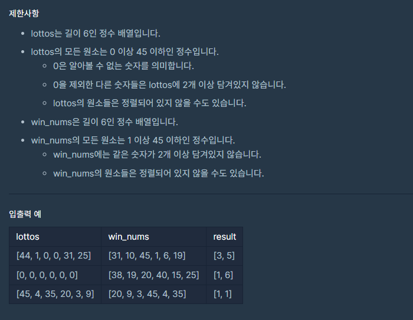

## 문제



## 

## 풀이

```python
def solution(lottos, win_nums):
    answer = []
    Zcnt=0
    cnt=0
    for i in lottos:
        if i in win_nums:
            cnt+=1
    Zcnt=lottos.count(0)
    a=7-(cnt+Zcnt)
    b=7-cnt
    if a==0:
        a=1
    if a==7:
        a=6
    if b==7:
        b=6
    if b==0:
        b=1
    answer=list([a,b])
    return answer
```


## 다른사람 풀이

<a  href="https://school.programmers.co.kr/learn/courses/30/lessons/77484/solution_groups?language=python3">프로그래머스</a>

```python
def solution(lottos, win_nums):

    rank=[6,6,5,4,3,2,1]

    cnt_0 = lottos.count(0)
    ans = 0
    for x in win_nums:
        if x in lottos:
            ans += 1
    return rank[cnt_0 + ans],rank[ans]
```

와 ㅋㅋ 난 뭘 한거지.. ㅠㅠ

이렇게 푸는 방법도 있었네요..
