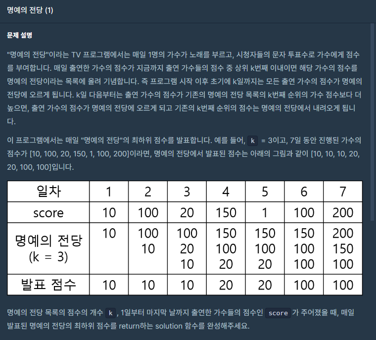
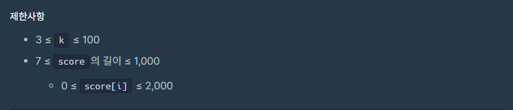

## 문제






## 풀이

```python
def solution(k, score):
    answer = []
    board=[]
    minValue=0
    for i in score:
        if len(answer)<k :
            board.append(i)    
        elif len(answer)>=k and minValue<=i:
            board.pop()
            board.append(i)
        minValue=min(board)
        board.sort(reverse=True)
        answer.append(min(board))    
    return answer
```


## 다른사람 풀이

<a  href="https://school.programmers.co.kr/learn/courses/30/lessons/138477/solution_groups?language=python3">프로그래머스</a>

```python
def solution(k, score):

    q = []

    answer = []
    for s in score:

        q.append(s)
        if (len(q) > k):
            q.remove(min(q))
        answer.append(min(q))

    return answer
```

여기서는 조건문 없이 일단 추가하고 그 다음 최소 값을 빼는 형태네요.

간단하니 부럽네요 ㅠ
