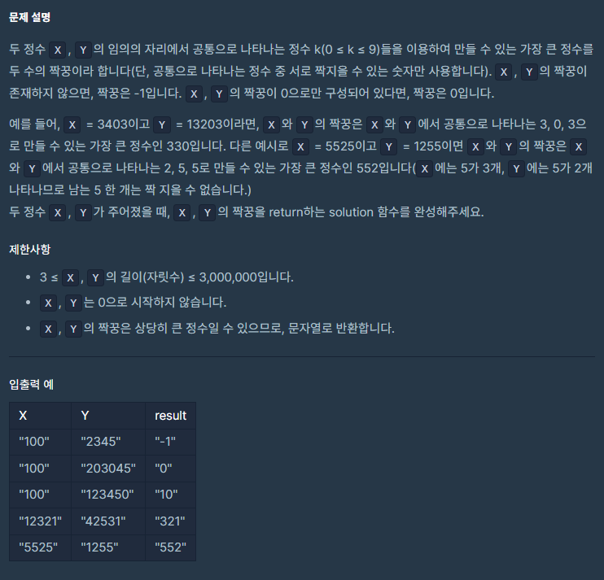

## 문제



## 풀이

```python
def solution(X, Y):
    xarr=[0]*10
    yarr=[0]*10
    rarr=[0]*10
    answer = ''
    for x in X:
        xarr[int(x)]+=1
    for y in Y:
        yarr[int(y)]+=1
    for i in range(10):
        rarr[i]=min(xarr[i],yarr[i])
    if sum(rarr)==0:
        return "-1"
    for i in range(9,-1,-1):
            answer+=str(i)*rarr[i]
    if answer[0]=='0':
        return '0'
    return answer
```


## 다른사람 풀이

<a  href="https://school.programmers.co.kr/learn/courses/30/lessons/131128/solution_groups?language=python3">프로그래머스</a>

```python
def solution(X, Y):
    xList = list(X.count(str(x)) for x in range(10))
    yList = list(Y.count(str(y)) for y in range(10))
    answer = ""
    for i in range(9, -1, -1):
        answer += str(i) * min(xList[i], yList[i])

    if answer == "":
        return "-1"
    elif answer[0] == "0" and answer[len(answer) - 1] == "0":
        return "0"
    else:
        return answer
```

collection의  Counter을 이용한 풀이네요. 완전 줄어들었네요 .

다음에는 Counter생각하고 풀어봐야겠어요!
