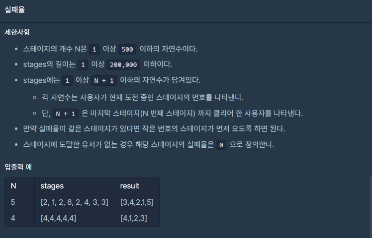

## 문제




## 풀이

```python
def solution(N, stages):
    answer = []
    narr=[0]*(N+1)# 실패율 분모
    s=[] #실패율 분자
    p=[] #실패율
    parr=[] #[실패율,index]
    arr=list(range(1,N+1)) #index배열
    for i in stages:
        for j in range(i):
            narr[j]+=1
    for i in range(1,N+1):
        s.append(stages.count(i))
    for i in range(N):
        p.append(s[i]/narr[i])
    for x,y in zip(p,arr):
        parr.append([x,y])
    parr=sorted(parr,key=lambda x:x[1]) # index기준으로 정렬
    parr=sorted(parr,key=lambda x:x[0],reverse=True) #실패율 기준으로 정렬
    for i in parr:
        answer.append(i[1])
    return answer
```

케이스들은 통과하는거 같은데 런타임 오류가 뜨는 몇개 때문에 통과를 못하는거 같네요.ㅠㅠ 좀 더 고민해 봐야겠어요


## 다른사람 풀이

<a  href="">프로그래머스</a>

```python

```

