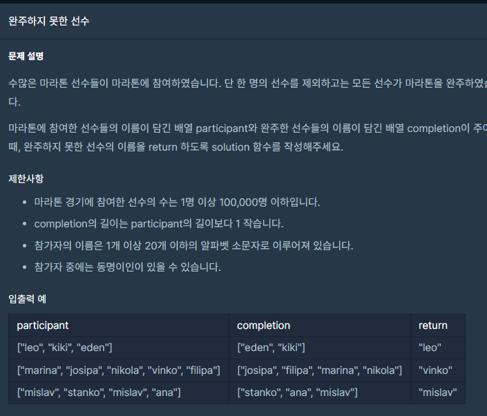

## 문제



## 풀이

```python
def solution(participant, completion):
    answer = ''
    participant.sort()
    completion.sort()
    for i in range(len(completion)):
        if participant[i] != completion[i]:
            answer= participant[i]
            break
    else:
        answer=participant[-1]        
    return answer
```


## 다른사람 풀이

<a  href="https://school.programmers.co.kr/learn/courses/30/lessons/42576/solution_groups?language=python3">프로그래머스</a>

```python
import collections


def solution(participant, completion):
    answer = collections.Counter(participant) - collections.Counter(completion)
    return list(answer.keys())[0]
```

구글에 검색해보니

collections의 Counter은

`Counter` 생성자에 문자열을 인자로 넘기면 각 문자가 문자열에서 몇 번씩 나타나는지를 알려주는 객체가 반환됩니다.

ex) ["Hello" ,"world"] => "Hello":1 "world":1

왼쪽: 오른쪽 => key: value  이런식이라서 key+=1, key-=1 를 통해서 Hello:0 ,world:0

처럼 더하고 뺄 수 있다고 하네요
