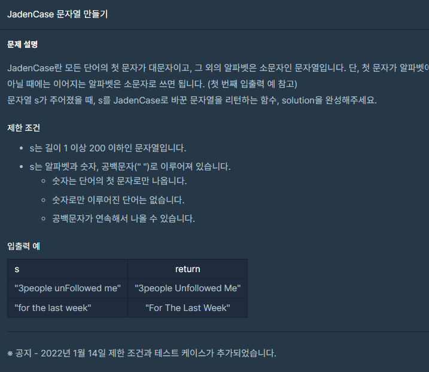

## 문제



## 풀이

```python
def solution(s):
    answer = ''
    b=[]
    a=list(map(str, s.split(' ')))
    for i in a:
            b.append(i.capitalize())
    return ' '.join(b)
```

str의 capitalize()함수는 첫글자를 대문자로 만들어줍니다.


## 다른사람 풀이

<a  href="https://school.programmers.co.kr/learn/courses/30/lessons/12951">프로그래머스</a>

```python
def Jaden_Case(s):
    return s.title()
```

title()이라는 함수도 있었네요 이거면 for 문도 사용 안 해도 되겠어요 ^^

책 제목처럼 첫글자를 대문자 뒤에 글자를 소문자로 만들어주는 함수라고 합니다. (띄어쓰기된 단어별로).
