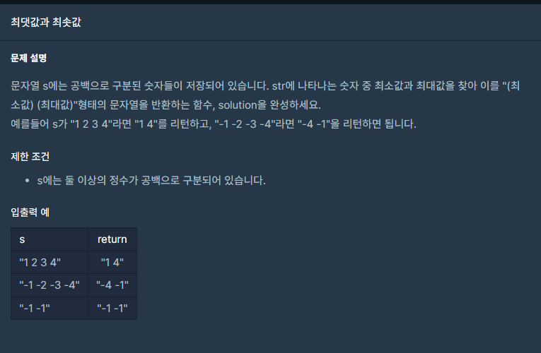

## 문제



## 풀이

```python
def solution(s):
    a=list(map(int, s.split()))
    return str(min(a))+" "+str(max(a))
    
```


드디어 2단계로 넘어왔네요 ㅎㅎ 3단계는 언제갈까요 ㅠㅠ


## 다른 사람 풀이

<a  href="https://school.programmers.co.kr/learn/courses/30/lessons/12939/solution_groups?language=python3">프로그래머스</a>

```python
def solution(s):
    s_list=s.split(" ")
    n = [int(i) for i in s_list]
    n.sort()

    return str(n[0]) + " " + str(n[len(n)-1])
```

저도 처음에는 이렇게 풀까 생각했다가 복잡할거 같아서 좀 더 고민했었습니다.
