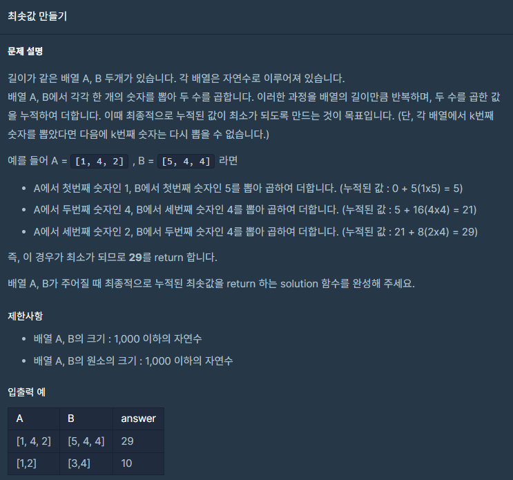

## 문제



## 풀이

```python
def solution(A,B):
    answer = 0
    A.sort()
    B.sort(reverse=True)
    for i in range(len(A)):     
        answer+=A[i]*B[i]
    return answer
```


## 다른 사람 풀이

<a  href="https://school.programmers.co.kr/learn/courses/30/lessons/12941/solution_groups?language=python3">프로그래머스</a>

```python
def getMinSum(A,B):
    return sum(a*b for a, b in zip(sorted(A), sorted(B, reverse = True)))
```

이분은 zip함수로 풀었네요.
