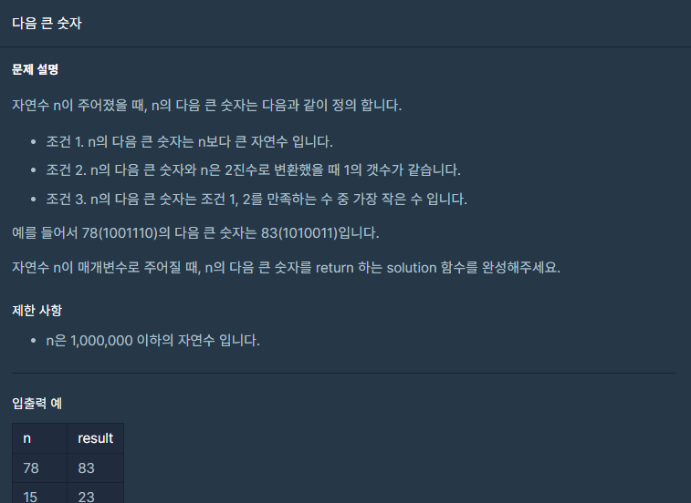

## 문제



## 풀이

```python
def solution(n):
    answer = 0
    cnt=bin(n)[2:].count('1')
    while(True):
        n+=1
        if cnt==bin(n)[2:].count('1'):
            break
    return n
```


## 다른 사람 풀이

<a  href="https://school.programmers.co.kr/learn/courses/30/lessons/12911/solution_groups?language=python3">프로그래머스</a>

```python
def nextBigNumber(n):
    num1 = bin(n).count('1')
    while True:
        n = n + 1
        if num1 == bin(n).count('1'):
            break
    return n
```

똑같이 풀었네요 ㅎㅎ
