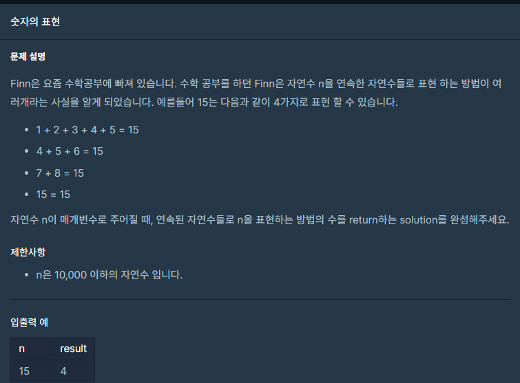

## 문제



## 풀이

```python
def solution(n):
    answer = 0
    cnt=0
    s=1
    while(s<n+1):
        nsum=0
        for i in range(s,n+1):
            nsum+=i
            if nsum == n:
                cnt+=1
                break
            elif nsum>n:
                break
        s+=1
    return cnt
```


## 다른 사람 풀이

<a  href="https://school.programmers.co.kr/learn/courses/30/lessons/12924/solution_groups?language=python3">프로그래머스</a>

```python
def expressions(num):
    return len([i  for i in range(1,num+1,2) if num % i is 0])
```

수학 등차수열 공식으로 풀었다고 댓글에 적혀있긴한데....

수학과를 갔어야 했나..?

다른 분들은 저랑 비슷하게 푸셨더라고요 ㅎㅎ
