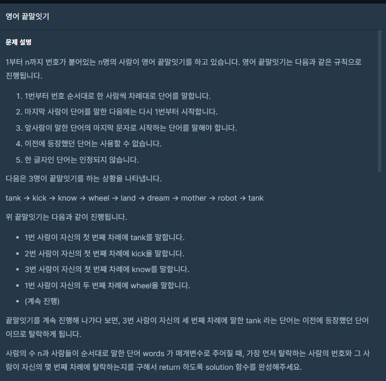
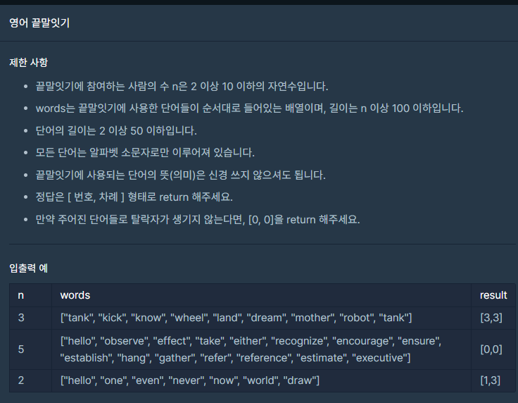

## 문제



## 

## 풀이

```python
def solution(n, words):
    answer = []
    wList=[]
    for i in words:
        if len(wList)== 0:
            wList.append(i)
        elif wList[-1][-1] == i[0]:
            for j in wList:
                if i == j:
                    break
            else:
                wList.append(i)
        else:
            break
    if len(words)==len(wList):
        return [0,0]
    answer=[len(wList)%n+1,len(wList)//n+1]
    return answer
```


## 다른 사람 풀이

<a  href="https://school.programmers.co.kr/learn/courses/30/lessons/12981/solution_groups?language=python3">프로그래머스</a>

```python
def solution(n, words):
    for p in range(1, len(words)):
        if words[p][0] != words[p-1][-1] or words[p] in words[:p]: return [(p%n)+1, (p//n)+1]
    else:
        return [0,0]
```

깔끔하네요 ㅎㄷㄷ..... 갑자기 내 코드가 지저분해보인 ㅠ
