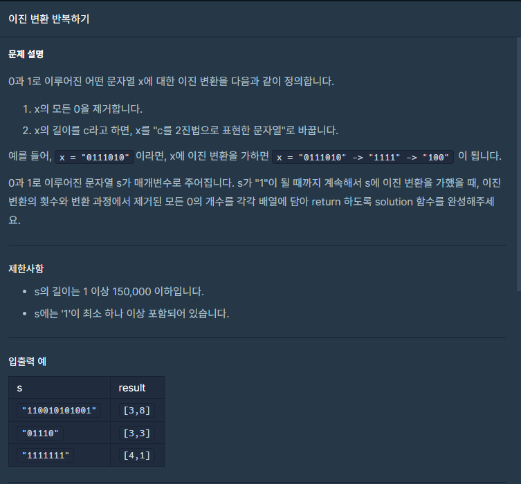

## 문제



## 풀이

```python
def solution(s):
    cnt=0
    zcnt=0
    while(s!='1'):
        zcnt+=s.count('0')
        s=bin(s.count('1'))[2:]
        cnt+=1    
    return [cnt,zcnt]
```


## 다른 사람 풀이

<a  href="https://school.programmers.co.kr/learn/courses/30/lessons/70129/solution_groups?language=python3">프로그래머스</a>

```python
def solution(s):
    a, b = 0, 0
    while s != '1':
        a += 1
        num = s.count('1')
        b += len(s) - num
        s = bin(num)[2:]
    return [a, b]
```

