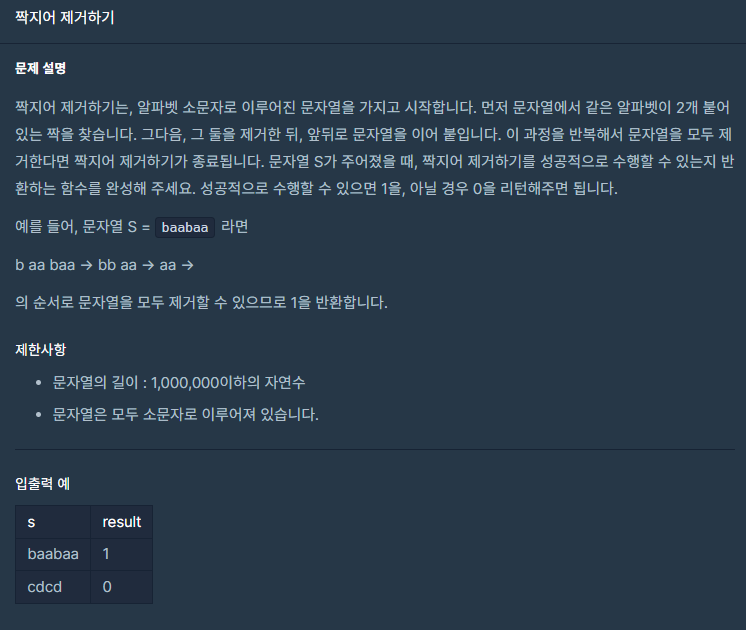

## 문제



## 풀이

```python
def solution(s):
    answer = 0
    stack=[]
    for i in s:
        if len(stack)==0:
            stack.append(i)
        elif stack[-1]==i:   
            stack.pop()
        else:
            stack.append(i)
    if len(stack)==0:
        answer=1
    return answer
```


## 다른 사람 풀이

<a  href="https://school.programmers.co.kr/learn/courses/30/lessons/12973/solution_groups?language=python3">프로그래머스</a>

```python
def solution(s):
    answer = []
    for i in s:
        if not(answer):
            answer.append(i)
        else:
            if(answer[-1] == i):
                answer.pop()
            else:
                answer.append(i)    
    return not(answer)
```

이 분도 비슷한 원리로 풀었네요.
