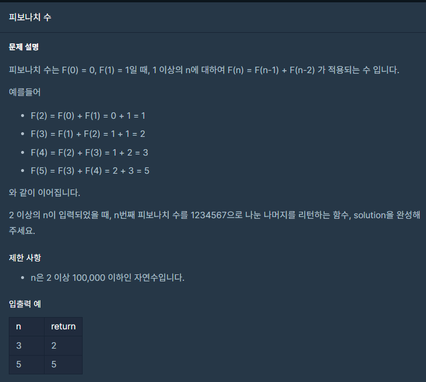

## 문제



## 풀이

```python
def F(n):
    if n==0:
        return 0
    if n==1:
        return 1
    return F(n-1)+F(n-2)

def solution(n):
    answer = F(n)
    return answer%1234567
```

처음 풀이는 런타임 에러가 떴습니다. ㅠㅠ python이 재귀함수에 최적화가 안되어있어서 오래걸린다고 하네요 ㅠㅠ

그래서! 

재귀함수가 아닌 for 함수와 배열을 이용해서 풀었어요

## 풀이2

```python
def solution(n):
    a=[0,1]
    for i in range(2,n+1):
        a.append((a[i-2]+a[i-1])%1234567)
    return a[n]
```


## 다른 사람 풀이

<a  href="https://school.programmers.co.kr/learn/courses/30/lessons/12945/solution_groups?language=python3">프로그래머스</a>

```python
def fibonacci(num):
    a,b = 0,1
    for i in range(num):
        a,b = b,a+b
    return a
```

이분은 전풀이를 다음 풀이에 더하면서 푸셨네요..

이러면 배열을 사용하지 않아도 풀 수 있겠네요 !
