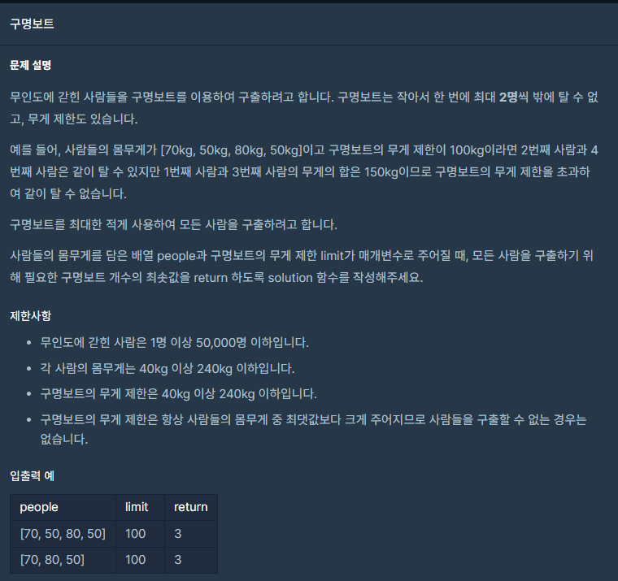

## 문제



## 풀이

```python
def solution(people, limit):
    answer = 0
    people.sort()
    a=0
    b=len(people)-1
    print(people) 
    while a<=b:
        if people[a]+people[b]<=limit:
            a+=1
            b-=1
            answer+=1
        else:
            b-=1
            answer+=1 
    return answer
```


## 다른 사람 풀이

<a  href="https://school.programmers.co.kr/learn/courses/30/lessons/42885/solution_groups?language=python3">프로그래머스</a>

```python
def solution(people, limit) :
    answer = 0
    people.sort()

    a = 0
    b = len(people) - 1
    while a < b :
        if people[b] + people[a] <= limit :
            a += 1
            answer += 1
        b -= 1
    return len(people) - answer
```

이분은 마지막에 전체 길이 중에 조건 가능한 부분만 빼서 결과를 구했네요

