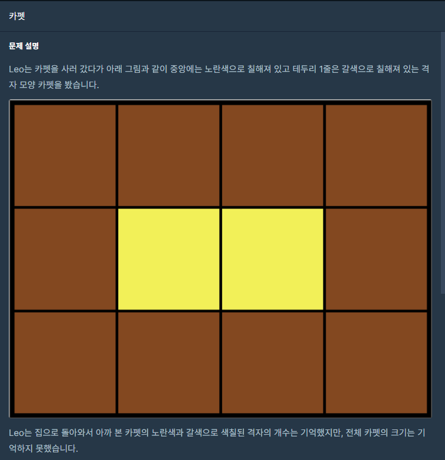
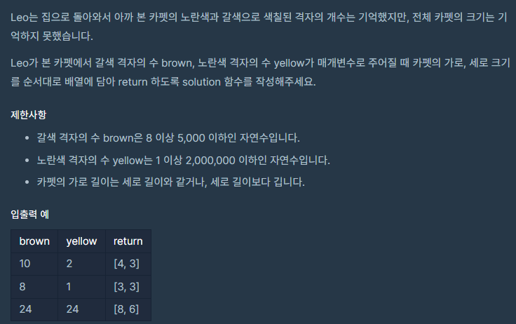

## 문제



## 

## 풀이

```python
def solution(brown, yellow):
    total=brown+yellow
    for i in range(1,total+1):
        if total%i==0:            
            a=i
            b=total//a           
            if a>=b:
                if 2*a+2*b-4==brown:
                    return[a,b]
    return answer
```

조건 :

1.total=brown+yellow

2.total=ab

3.(a-2)(b-2)=yellow

=>풀면 ab-2a-2b+4=yellow인데 2번 조건식을 대입하면

total-2a-2b+4=yellow이고 1번을 대입하면

brown+yellow-2a-2b+4=yellow이다

정리하면 brown=2a+2b-4를 만족한다.

4.a>=b


## 다른 사람 풀이

<a  href="https://school.programmers.co.kr/learn/courses/30/lessons/42842/solution_groups?language=python3">프로그래머스</a>

```python
def solution(brown, red):
    for i in range(1, int(red**(1/2))+1):
        if red % i == 0:
            if 2*(i + red//i) == brown-4:
                return [red//i+2, i+2]
```

이분은 가로 * 세로 = 격자 합, 둘레의 합(가로*2 + 세로*2 - 겹치는부분4) = 갈색 둘레 

이런식으로 풀었네요 ㅎㅎ
