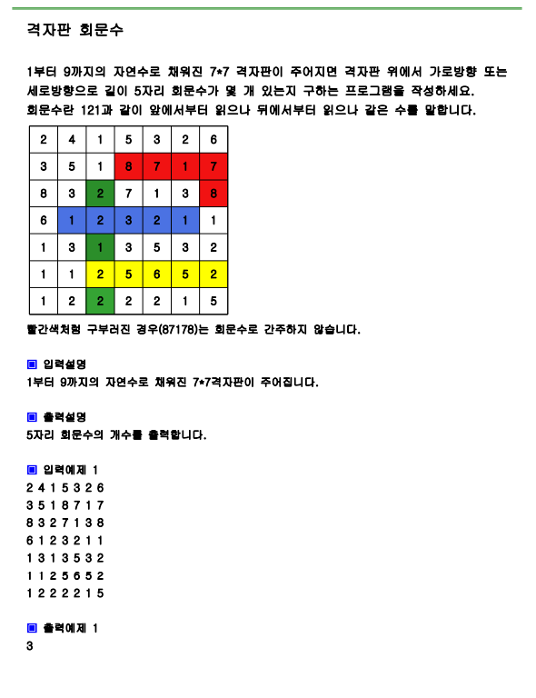

---

layout: single
title: "격자판 회문수"
categories: Python_algorizm(inflearn)
tag: [python]

---



# 풀이

```python
import sys
sys.stdin=open("input.txt","rt")

board=[list(map(int,input().split())) for _ in range(7)]

cnt=0

for i in range(3):
    for j in range(7):
        tmp=board[j][i:i+5]
        if tmp==tmp[::-1]: #reverse같은지 
            cnt+=1
        for k in range(2):
            if board[i+k][j] != board[i+5-k-1][j]:
                break
        else:
            cnt+=1 
#행은 슬라이스 되지만 열은 슬라이스 안됨

print(cnt)

```

# 결과

3으로 정상 출력된다.
