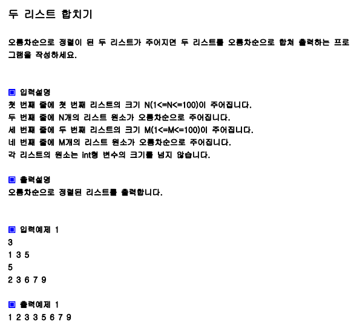

# 풀이

```pytho
import sys
sys.stdin=open("input.txt","r")

n=int(input())
a=list(map(int,input().split()))
m=int(input())
b=list(map(int,input().split()))

p1=p2=0
c=[]
while p1<n and p2<m:
    if a[p1]<=b[p2]:
        c.append(a[p1])
        p1+=1
    else:
        c.append(b[p2])
        p2+=1
if p1<n:
    c=c+a[p1:]
if p2<m:
    c=c+b[p2:]
for x in c:
    print(x, end=' ')

```

# 입력

```
3
1 3 5
5
2 3 6 7 9
```

# 출력

1 2 3 3 5 6 7 9 으로 정상 출력된다.
