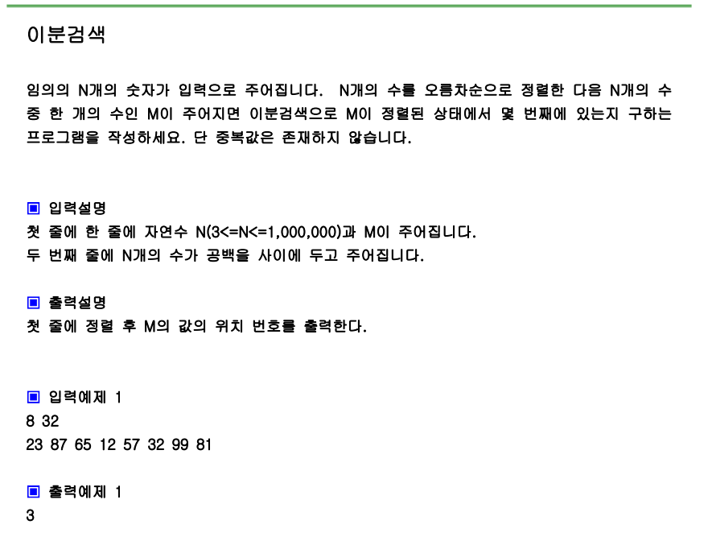

# 문제



# 풀이

```python
import sys
sys.stdin=open("input.txt","rt")
#이분검색은 찾을려는 숫자가 1024범위라면 log2 1024초만에 된다는뜻
n ,m = map(int,input().split())

a=list(map(int,input().split()))
a.sort()
lt=0
rt=n-1

 


while lt<=rt:
    mid=(lt+rt)//2
    if a[mid] == m:
        print(mid+1)
        break
    elif a[mid] > m:
        rt=mid-1
    else:
        lt=mid+1
    
```

# 결과

3으로 정상 출력됩니다.
