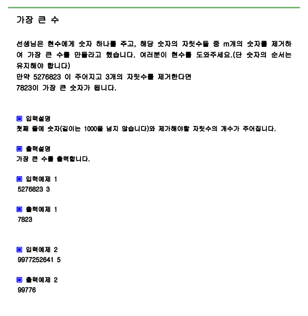

# 문제



# 풀이

```python
import sys
sys.stdin=open("input.txt","rt")

num, m=map(int,input().split())

num=list(map(int,str(num)))

stack=[]

for x in num:
    while stack and m>0 and stack[-1]<x:
        stack.pop()
        m-=1
    stack.append(x)
if m != 0:
    stack=stack[:-m]


res=''.join(map(str,stack))#join 매개변수는 리스트
print(res)


```

# 결과

7823으로 정상 출력됩니다.
